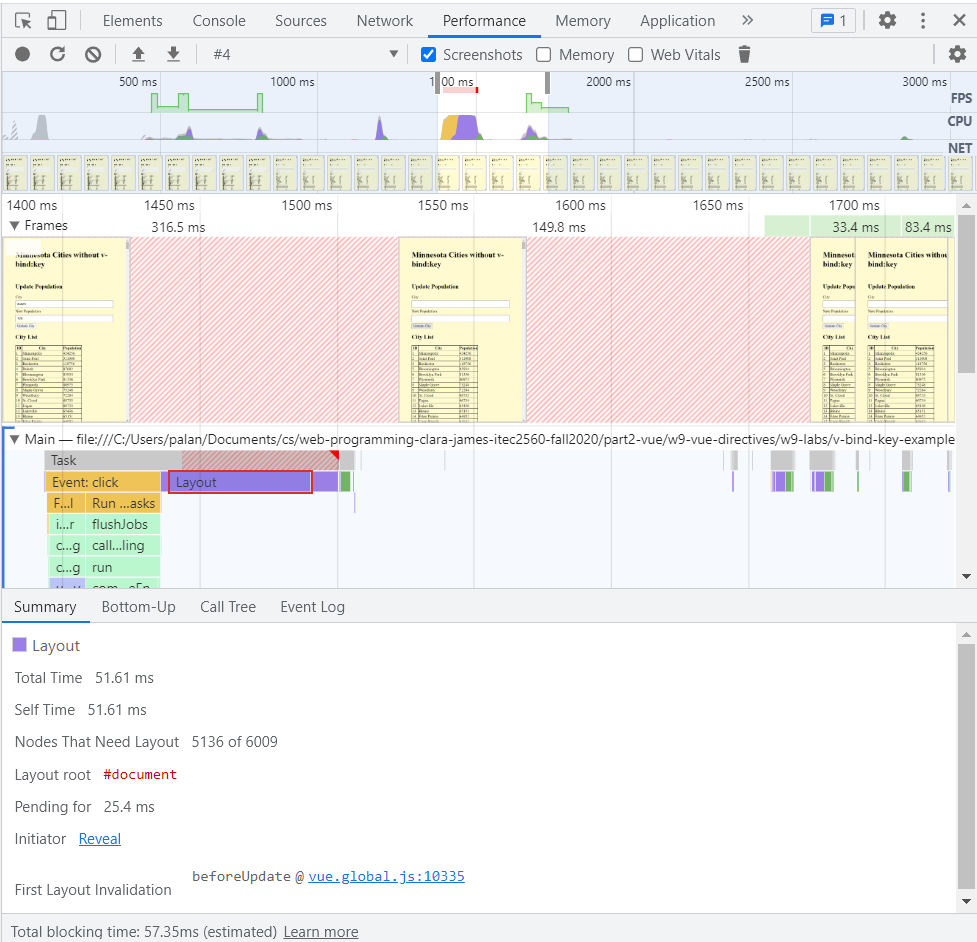
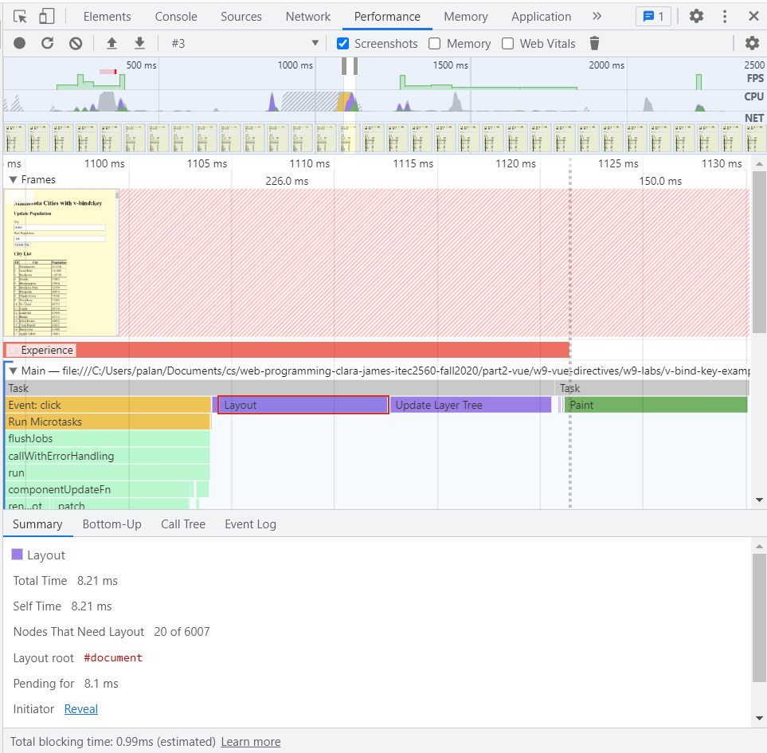

# v-bind:key

`v-bind:key` is not needed if you will not change the order of the elements generated with a `v-for` loop. However, it is not incorrect to use it.

`v-bind:key` should be used if you are displaying many elements in a table, and you will need to re-order them. In this example, the table is re-drawn when the population of a city changes, to keep the table in order.

However, it is not wrong to leave it out. Your app will be slighly slower.

If your app is generating more complex HTML in a `v-for` loop, you may start to notice a delay when the data is updated.

Example:
~51ms to re-draw table without the `v-bind:key`. About 5000 nodes (HTML elements) have to be re-drawn
~8ms to re-draw table with the `v-bind:key`. 20 nodes (HTML elements) have to be re-drawn

Screenshots from performance tool in Chrome dev tools

## No `v-bind:key`

## With `v-bind:key`

In short, having a `v-bind:key` improves the performance
